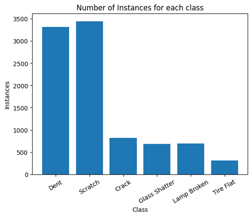
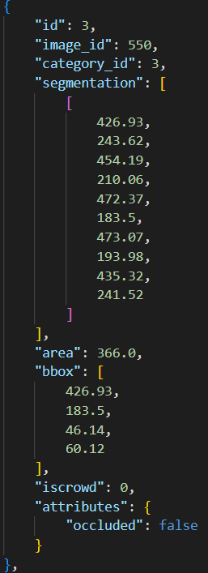
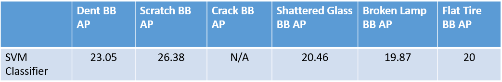
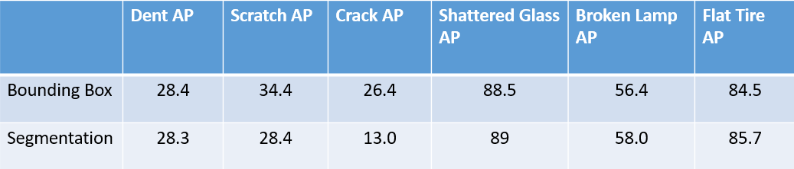
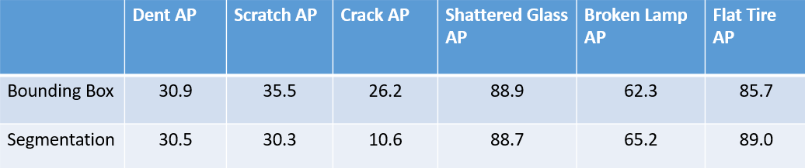
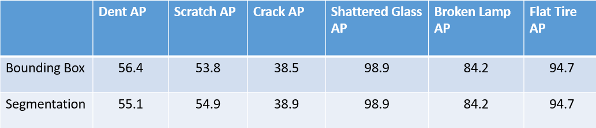
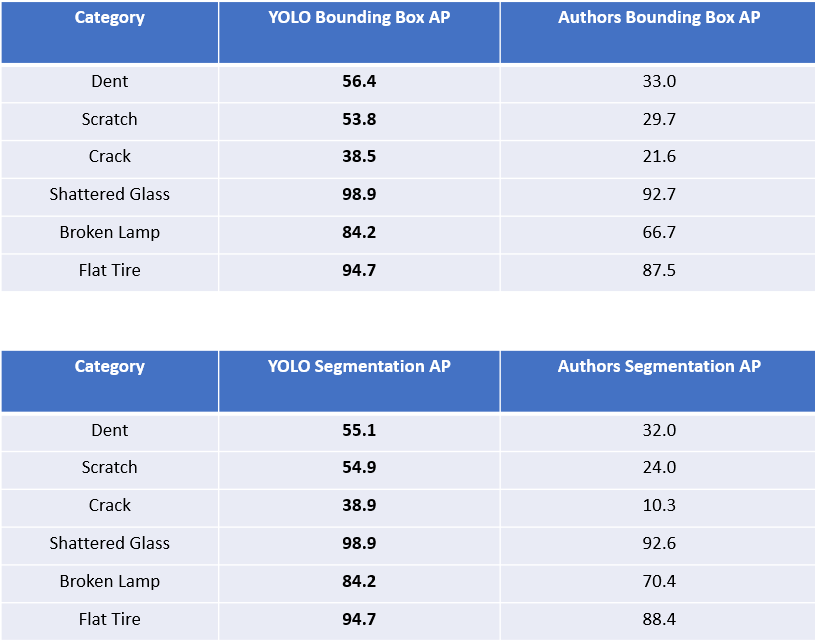
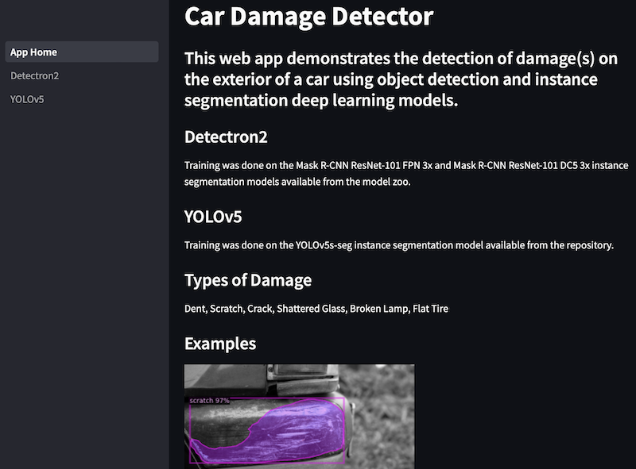
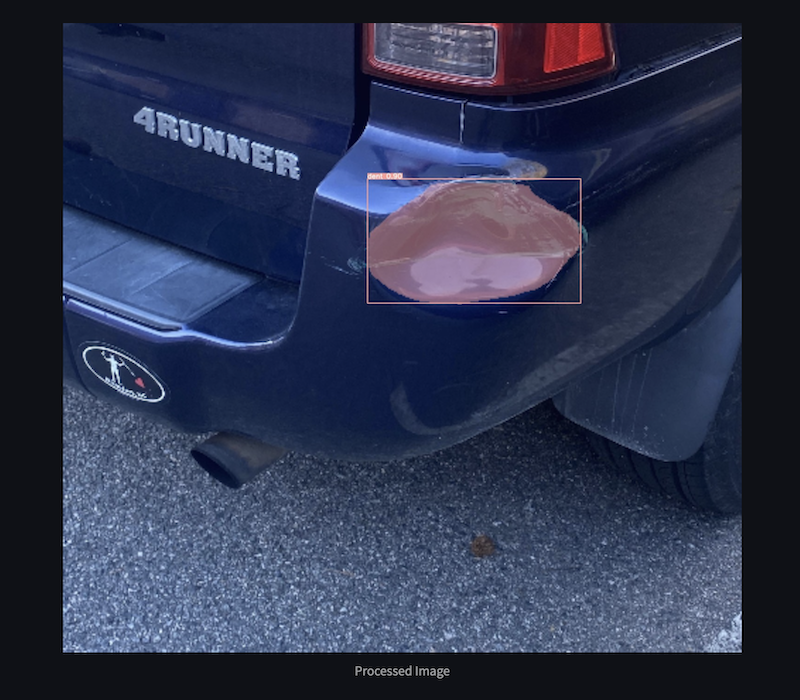

# Car Damage Detector
# Problem Statement
Being able to automatically identify damages to cars has important applications in the rental car industry. Each time a rental vehicle in rented out or returned, it is assesed for damages so they can be recorded and attributed to the offending party. Enterprise, the largest player in the industry, has over 1 million rental cars in service each year. They could save a lot of time and money by utilizing object-detection models to perform this analysis automatically each time. **Our goal is to build an object-detection and instance segmentation model that can identify the type and location of damages to cars**.

# Data Source
For this project we are using the [CarDD Dataset](https://arxiv.org/pdf/2211.00945.pdf) compiled by Xinkuang Wang, Wenjing Li, and Zhongcheng Wu. This dataset consists of 4000 labeled images with 9000 instances of car damages. there are six types of damages present in the dataset: `dent`, `scratch`, `crack`, `glass shatter`, `lamp broken`, and `tire flat`. The breakdown is as follows:



The labels follow the standard COCO format and contain three key pieces of information: the classification of the damage, the bounding box surrounding the damage, and the segmentation showing the pixels that represent the damage. 



We do not have the rights to distribute the data, so please email the authors directly if you would like to download the data for yourself. 

# Modeling Approaches
## Non-Deep Learning: Support Vector Machine
For a baseline, we wanted to compare the effectiveness of a non-deep learning algorithm for object detection as they are generally not considered when working with images. We decided to experiment with a Support Vector Machine (SVM) classifier because they have often been shown to perform better than other algorithms on datasets with large amount of features. Since every pixel in an image is it's own feature, this felt like a perfect match. 

A sliding window approach was used to perform the object detection. One of the downsides of this is that the window has a fixed size. To avoid predicting the same size box for all the damages, we tracked regions in the image that were predicted to be damage the most using a mask, and then all the regions above a given threshold formed the bounding box detection. The code for this experiment can be found in the `svm_detection` directory. 

For our experiments, we used [average precision (AP)](https://blog.paperspace.com/mean-average-precision/) The results of our SVM classifier are shown below:



We only analyzed the effectiveness on the bounding box because as you will see, it was not close to what the deep learning algorithms were able to achieve. For that reason, we thought it would be a waste of time to also model the segmentation, which is often more difficult. 

## Deep Learning 1: Detectron 2 (Mask R-CNN)
We used [Detectron2](https://github.com/facebookresearch/detectron2) to train two different models on our data: a `Mask R-CNN ResNet-101 FPN 3x` and a `Mask R-CNN ResNet-101 DC5 3x` model. We decided to try two so we could experiment with different architectures and see what worked best. The two models differed in the feature pyramid network (FPN) part of the backbone - the former has a regular FPN, while the latter has a slightly different FPN which consists of a Dilated C5 (i.e. dilation is performed on the feature map extracted from Convolution5 layer).

The first model was able to achieve a **53.1** and **50.4** mean average precision (mAP) for the bounding box and segmentation respectively. The class breakdown is as follows:



The second model was able to achieve a **54.9** and **52.4** mean average precision (mAP) for the bounding box and segmentation respectively. The class breakdown is as follows:



The results were significantly better than the SVM results, especially in the final 4 categories. It is also worth noting that changing the backbone of the Detectron2 model led to some incremental improvements, but nothing super significant. 

## Deep Learning 2: YOLOv5 (YOLOv5s Segmentation)
After playing around with Detectron we decided to experiment with YOLO as well. Although YOLO is best known for its ability to make predictions very quickly in near-real time, it manages to achieve that with very accurate results as well. Through the use of scripts in the [YOLOv5 Repo](https://github.com/ultralytics/yolov5), we were able to train the model on our own dataset. 

The YOLOv5 boasted a **71.1 mAP** for both the bounding box and segmentation problems, with the following categorical breakdown:


Compared to the Detectron2 and SVM classifier, the YOLOv5 outperforms in every category for both the bounding box and segmentation AP, along with the mAP of Detectron2. 

# Results
Results were compared by looking at AP for each of the six classes in the dataset. This metric was computed for both the bounding box and the segmentations. We were able to achieve better results in each class for both the bounding box and segmentation AP. The authors achieved mAP of **54.3** and **52.5** for the bounding box and segmentation tasks respectively, both lower than the **71.1** achieved by YOLOv5. A comparison of our class-specific results and the authors results is shown below:



With a large amount of computing resources, more hyperparameter tuning, or more patience than we have, we believe these results may also be possible to improve upon. 

# Deployment
A no-frills web application was deployed using Streamlit to serve the deep learning models. Due to the model weights being large binary files, these files were not hosted on GitHub. Instead, they were fetched from an external file server and cached locally while the app is awake. The requirements to deploy the deep learning models using Streamlit are available in the `deploy/requirements.txt` file.

# Demo
The demo app is hosted on Streamlit Cloud. [](https://car-damage-detector.streamlit.app) to try out the car damage detector.

Some screenshots of the demo app:





To try out the detector, choose from either Detectron2 or YOLOv5 from the sidebar and pick a model from the dropdown menu. Next, upload a picture of your vehicle with potential exterior damage to test the model. The resulting image with annotation (if any) will be shown below. You may adjust the confidence threshold using the slider to see if the prediction varies.

# Logistics
Please refer to the README document in the respective model subdirectories, i.e. `/svm_detection/README.md`, `/deeplearning_1/README.md`, and `/deeplearning_2/README.md` for step-by-step instructions on how to setup the appropriate Python environment, how to train the models, and how to evaluate them.

# Repository Structure
```
|____requirements.txt
|____deeplearning_2
| |____TrainResult.csv
| |____requirements.txt
| |____car.yaml
| |____README.md
| |____data_processing.py
|____imgs
| |____class_breakdown.png
| |____svm_results.png
| |____demo_2.png
| |____demo_1.png
| |____previous_class_results.png
| |____data_coco_format.png
| |____detectron_model2_results.png
| |____detectron_model1_results.png
| |____results_comparison.png
| |____yolo_results.png
|____deploy
| |____requirements.txt
| |____images
| | |____example1.png
| | |____example3.jpg
| | |____example2.png
| |____App_Home.py
| |____packages.txt
| |____pages
| | |____Detectron2.py
| | |____YOLOv5.py
|____models
| |____SVM_MODEL.pkl
|____README.md
|____svm_detection
| |____heatmap.py
| |____requirements.txt
| |____README.md
| |____svm_training.py
| |____svm_detection.py
|____.gitignore
|____deeplearning_1
| |____requirements.txt
| |____README.md
| |____train.py
| |____customtrainer.py
| |____eval.py
|____data
|____notebooks
  |____SVM_scratch.ipynb
```